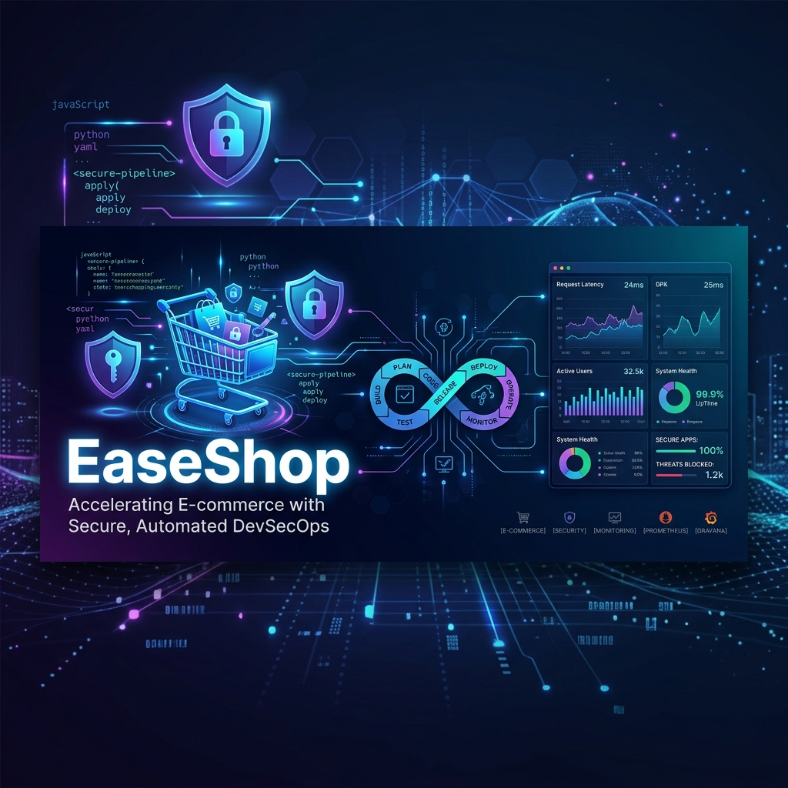

# 🛒 EaseShop: Secure DevSecOps E-commerce Platform

[](https://www.jenkins.io/)
[](https://www.sonarqube.org/)
[](https://aquasecurity.github.io/trivy/)
[](https://prometheus.io/)
[](https://grafana.com/)
[](https://www.docker.com/)

**EaseShop** is a cutting-edge, microservices-based e-commerce ecosystem designed with a **Security-First** and **Automated-Everything** philosophy. It demonstrates a complete **DevSecOps lifecycle**, integrating static analysis, dependency scanning, container security, and real-time monitoring.

---

## 🏗 Architecture Overview

EaseShop is built on a scalable microservices architecture, where each service handles a specific domain. All traffic is routed through a centralized **API Gateway** and monitored by a dedicated **Observability Stack**.

### Core Services:
- 🔐 **Auth Service**: Secure identity management using JWT & Bcrypt.
- 📦 **Product Service**: Inventory and catalog management.
- 🛍️ **Order Service**: End-to-end checkout and order tracking.
- 👤 **User Service**: Profile and address management.
- 🛠️ **Admin Service**: Backend logic for platform management.
- 🌐 **Frontend**: Modern, responsive UI (Vite + Vanilla JS).
- 🚪 **API Gateway**: Nginx-based routing and load balancing.

---

## 🛡️ DevSecOps Pipeline

Our Jenkins-driven CI/CD pipeline ensures that every commit is tested, scanned, and deployed securely.

| Stage | Tool | Description |
| :--- | :--- | :--- |
| **Static Analysis** | **SonarQube** | Detects bugs, vulnerabilities, and code smells. |
| **Dependency Scan** | **OWASP** | Scans for vulnerable third-party libraries. |
| **Image Scanning** | **Trivy** | Scans Docker images for OS-level vulnerabilities. |
| **Deployment** | **Docker Compose** | Orchestrates the system and monitoring stack. |
| **Notifications** | **Gmail/Email** | Real-time alerts on build success or failure. |

---

## 📊 Monitoring & Observability

We don't just deploy; we observe. The platform includes a pre-configured monitoring stack:

- **Prometheus**: Collects time-series metrics from all services and the host OS.
- **Grafana**: Beautiful dashboards for visualizing system health (Access: `http://localhost:3000`).
- **Node Exporter**: Detailed hardware and OS-level metrics collection.

---

## 🚀 Quick Start

### Prerequisites
- [Docker & Docker Compose](https://www.docker.com/)
- [Jenkins](https://www.jenkins.io/) (for CI/CD automation)

### Deploy the Full Stack (App + Monitoring)
Clone the repo and run:
```bash
docker-compose -f docker-compose.yml -f docker-compose.monitoring.yml up -d
```

### Access Points
- **Frontend UI**: [http://localhost](http://localhost)
- **API Gateway**: [http://localhost/api](http://localhost/api)
- **Grafana Dashboards**: [http://localhost:3000](http://localhost:3000)
- **Prometheus UI**: [http://localhost:9090](http://localhost:9090)

---

## 📂 Project Structure

```text
.
├── Jenkinsfile               # DevSecOps Pipeline Definition
├── docker-compose.yml        # Core Application Services
├── docker-compose.monitoring.yml # Monitoring Stack (Prom/Grafana)
├── monitoring/               # Monitoring configurations
├── services/                 # Backend Microservices
├── frontend/                 # Web Interface
├── gateway/                  # Nginx API Gateway
└── database/                 # SQL Initialization Scripts
```

---

## 🔑 Configuration & Secrets

Secrets are managed via Jenkins credentials and environment variables. Key variables:
- `JWT_SECRET`: Secret for signing tokens.
- `SONAR_URL`: Endpoint for SonarQube analysis.
- `DOCKER_HUB_USER`: Your Docker Hub username.

---

## 🤝 Contributing

We welcome contributions! Please follow the [standard Git workflow](https://github.com/ahmadali-114/E-commerce-Web/blob/main/CONTRIBUTING.md).

1. Fork the project.
2. Create your feature branch.
3. Commit your changes.
4. Push to the branch.
5. Open a Pull Request.

---

## 📄 License

Distributed under the **ISC License**. See `package.json` for details.

---
*Developed with ❤️ as a Final Year Project for Modern DevSecOps.*